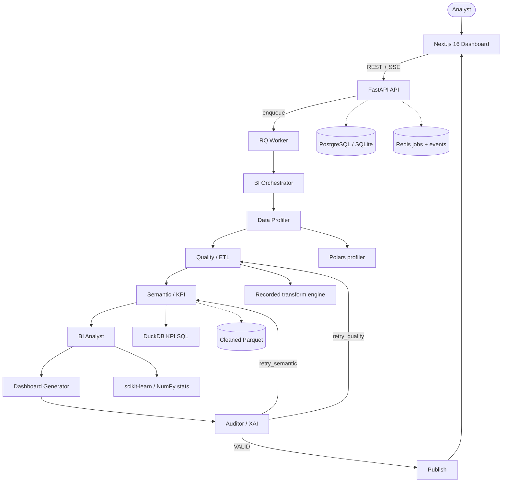

# BIFlow — Multi-Agent Business Intelligence Platform

[](https://python.org)
[](https://fastapi.tiangolo.com)
[](https://langchain.com)
[](https://nextjs.org)
[](https://react.dev)
[](https://www.typescriptlang.org/)
[](https://tailwindcss.com/)
[](https://www.docker.com/)
[](LICENSE)

**BIFlow** is an enterprise-grade multi-agent Business Intelligence platform. Powered by **LangGraph**, an optional **OpenAI-compatible LLM** (OpenAI, Groq, or local), and a deterministic analytical engine, it orchestrates a team of specialized agents to profile raw datasets, clean them with recorded lineage, infer a semantic model, compute a KPI catalogue in DuckDB, detect statistical patterns, generate an interactive dashboard, and audit every published number back to the SQL that produced it.

The frontend never invents a metric. Every value on screen is computed by **Polars**, **DuckDB**, and a validated formula grammar. The LLM, when configured, proposes structure — extra KPIs, insight wording, widget layout — and every proposal is re-checked against the real schema or the real computed values before it can publish.

---

## Key Capabilities

- **LangGraph Multi-Agent Pipeline**: A real `StateGraph` routes work through seven agents with bounded auditor feedback edges (`retry_quality`, `retry_semantic`). Agents are idempotent, so a retry never duplicates artefacts.
- **Zero-Hallucination Analytics**: No number shown to a user is produced by a language model. Formulas compile to parameter-free, fully quoted DuckDB SQL; invented columns fail at compile time instead of becoming a plausible wrong value.
- **Evidence-Based Profiling & Quality**: Schema inference, type detection, missingness, duplicates, PII flags, join discovery (overlap + uniqueness — never name matching alone), and a five-axis quality scorecard.
- **Conservative ETL with Lineage**: Only allowed transforms run (`trim_whitespace`, `empty_to_null`, `drop_duplicates`, …). Outliers are never dropped automatically. Every step records rows affected, reason, and before/after examples.
- **Role-Bound KPI Catalogue**: The profiler binds business roles (`quantity`, `unit_price`, `order_id`, `event_date`, …). KPIs instantiate only when those roles exist — a dataset without a cost column yields no margin KPI.
- **Statistical BI Analysis**: Trend regression, z-score / IQR anomalies, Pareto, concentration, correlation, and period-over-period change. Insights must cite computed evidence or they are rejected.
- **Trusted Dashboard Rendering**: Agents emit a structured widget specification. The Next.js UI renders it through trusted components — never arbitrary generated frontend code.
- **Audit, XAI, and Exports**: Every KPI stores formula, SQL, source tables, run id, and an explanation. Export the same assembled report as JSON, CSV, Excel, or PDF.

---

## System Architecture



```
RAW FILE → PROFILE → CLEAN → SEMANTIC MODEL → KPI ENGINE → ANALYST → DASHBOARD → AUDIT → PUBLISH
```

Full design notes live in [docs/architecture.md](docs/architecture.md).

### Specialized Agents

| Agent | Responsibility | Deterministic engine | LLM role (optional) |
|---|---|---|---|
| **BI Orchestrator** | Domain inference, run plan, configuration | Column / objective heuristics | Plan summary and risks |
| **Data Profiler** | Types, statistics, missingness, PII, joins, role binding | Polars | Interpret warnings |
| **Data Quality / ETL** | Five-axis scorecard, conservative transforms | Quality engine + recorded ETL | Plan notes |
| **Semantic / KPI** | Dimensions, measures, catalogue, formula compile + execute | DuckDB + KPI grammar | Propose extra KPIs |
| **BI Analyst** | Trends, anomalies, Pareto, concentration, correlation | NumPy / scikit-learn | Word insights from evidence |
| **Dashboard Generator** | Widget spec bound to computed metrics | Trusted layout rules | Layout suggestions |
| **BI Auditor / XAI** | Validate artefacts, explain, decide publish | Formula / SQL / binding checks | Validation narrative |

Auditor verdicts:

| Verdict | Condition | Next |
|---|---|---|
| `VALID` | KPI success ratio ≥ 60%, quality ≥ 55, dashboard bound | `publish` |
| `retry_semantic` | Too few KPIs computed | back to Semantic |
| `retry_quality` | Data too poor to publish | back to Quality |
| `INVALID` | No widgets could be produced | `publish`, unpublished |

The retry budget is consumed **inside the auditor node**, not the routing edge — incrementing a counter in a LangGraph conditional edge is discarded. There is a regression test for the infinite-loop case.

---

## Tech Stack

| Layer | Technologies |
|---|---|
| **Multi-Agent Core** | LangGraph 0.6, LangChain Core, OpenAI-compatible LLM (OpenAI / Groq / local) |
| **Backend API** | FastAPI 0.116, Pydantic v2, SQLAlchemy 2.0, Alembic, Uvicorn, RQ |
| **Analytical Engine** | Polars, DuckDB, PyArrow, sqlglot, NumPy, SciPy, scikit-learn |
| **Frontend Web** | Next.js 16 (App Router), React 19, TypeScript, Tailwind CSS 4, TanStack Query, Recharts, Lucide |
| **Infrastructure** | PostgreSQL 16 *(or SQLite)*, Redis 7 *(optional)*, Docker Compose |

PostgreSQL and Redis are the production choices, not hard requirements. Column types in `app/db/types.py` map to `JSONB` / `uuid` on PostgreSQL and `JSON` / `CHAR(36)` elsewhere. The event bus falls back to an in-process buffer when Redis is unreachable, so the pipeline can run on a laptop with nothing but Python and Node.

---

## Getting Started

### Prerequisites

- **Python 3.12+** and **Node.js 20+**
- Docker Desktop *(optional, recommended for the full stack)*
- An OpenAI or Groq API key *(optional — the pipeline still computes real KPIs without one)*

---

### Option A: Docker Compose (Recommended)

1. **Clone the repository:**
   ```bash
   git clone https://github.com/Eya-Jmaa/BIFlow.git
   cd BIFlow
   ```

2. **Configure environment variables:**
   ```bash
   cp .env.example .env
   # Optional: set OPENAI_API_KEY or GROQ_API_KEY
   ```

3. **Launch the stack** (frontend, backend, worker, PostgreSQL, Redis). Migrations run when the backend starts:
   ```bash
   docker compose up --build
   ```

**Active endpoints:**

- **Web dashboard**: [http://localhost:3000](http://localhost:3000)
- **FastAPI docs**: [http://localhost:8000/docs](http://localhost:8000/docs)
- **Health**: [http://localhost:8000/health](http://localhost:8000/health)

---

### Option B: Local Development (Without Docker)

SQLite and an in-memory event bus are used automatically when PostgreSQL / Redis are not configured.

#### 1. Backend

```bash
cd backend
python -m venv .venv
# Windows:
.venv\Scripts\activate
# Linux / macOS:
# source .venv/bin/activate

pip install -r requirements.txt
```

```bash
# Windows PowerShell
$env:DATABASE_URL = "sqlite:///./biflow.db"
uvicorn app.main:app --reload --port 8000
```

```bash
# Linux / macOS
DATABASE_URL="sqlite:///./biflow.db" uvicorn app.main:app --reload --port 8000
```

#### 2. Frontend

In a second terminal:

```bash
cd frontend
npm install
npm run dev
```

Open [http://localhost:3000](http://localhost:3000). API docs: [http://localhost:8000/docs](http://localhost:8000/docs).

---

### First run

1. Download a real public dataset (or upload your own CSV / Parquet / Excel):
   ```bash
   python scripts/download_demo_data.py
   ```
   See [data/documentation/uci-online-retail.md](data/documentation/uci-online-retail.md) and [data/documentation/olist.md](data/documentation/olist.md).
2. Create a project and enter a business objective.
3. Open **Datasets** and upload the file.
4. Click **Run pipeline**. Watch agents complete on the Pipeline screen.
5. Walk **Profile → Clean → Model → Measures → Analyze → Visualize → Audit**.
6. Click a KPI to inspect formula, compiled SQL, lineage, and the XAI explanation.
7. Export JSON / CSV / Excel / PDF from Settings.

A ten-minute walkthrough is in [docs/demo.md](docs/demo.md).

---

## Configuration Reference

Key variables in `.env` (see `.env.example`):

| Variable | Required | Default | Description |
|---|:---:|---|---|
| `DATABASE_URL` | No | SQLite file if unset locally | PostgreSQL or SQLite connection |
| `REDIS_URL` | No | in-process fallback | RQ queue and SSE event bus |
| `LLM_PROVIDER` | No | `openai` | `openai`, `groq`, or `local` — must match the key you set |
| `LLM_MODEL` | No | `llama-3.3-70b-versatile` | Model name for the selected provider |
| `OPENAI_API_KEY` / `GROQ_API_KEY` | No | — | Never sent to the frontend |
| `LLM_ENABLED` | No | `true` | `false` runs fully deterministically |
| `DATA_DIR` | No | `./data` | RAW and processed storage |
| `MAX_UPLOAD_MB` | No | `200` | Upload size limit |
| `PIPELINE_MAX_RETRIES` | No | `2` | Bound on each auditor feedback edge |
| `API_CORS_ORIGINS` | No | `localhost` + `127.0.0.1:3000` | Allowed browser origins |

`GET /health` reports whether the LLM is active and, if not, why. A provider/key mismatch is otherwise silent because every agent falls back to deterministic output.

---

## API Reference

Interactive OpenAPI docs: [http://localhost:8000/docs](http://localhost:8000/docs).

| Method | Endpoint | Description |
|---|---|---|
| `GET` | `/health` | Service status and LLM configuration |
| `POST` | `/api/projects` | Create a project with a business objective |
| `GET` | `/api/projects` | List projects |
| `GET` | `/api/projects/{id}` | Project detail |
| `DELETE` | `/api/projects/{id}` | Delete a project |
| `POST` | `/api/projects/{id}/datasets` | Upload CSV, Parquet, or Excel |
| `GET` | `/api/projects/{id}/datasets` | List uploaded datasets |
| `POST` | `/api/projects/{id}/pipeline/run` | Enqueue a LangGraph pipeline run |
| `GET` | `/api/projects/{id}/pipeline-runs` | Run history |
| `GET` | `/api/pipeline-runs/{run_id}` | Run status |
| `GET` | `/api/pipeline-runs/{run_id}/steps` | Agent step timeline |
| `GET` | `/api/pipeline-runs/{run_id}/stream` | Live SSE events |
| `GET` | `/api/projects/{id}/profile` | Profiler output |
| `GET` | `/api/projects/{id}/quality` | Quality scorecard and issues |
| `GET` | `/api/projects/{id}/semantic-model` | Dimensions, measures, relationships |
| `GET` | `/api/projects/{id}/kpis` | KPI catalogue with computed values |
| `GET` | `/api/projects/{id}/kpis/{kpi_id}` | Formula, SQL, lineage, XAI |
| `GET` | `/api/projects/{id}/insights` | Evidence-grounded insights |
| `GET` | `/api/projects/{id}/dashboard` | Dashboard specification + widget data |
| `GET` | `/api/projects/{id}/audit` | Audit events and explanations |
| `GET` | `/api/projects/{id}/lineage` | RAW → transform → KPI graphs |
| `POST` | `/api/projects/{id}/query` | Recompute a stored KPI with trusted filters |
| `GET` | `/api/projects/{id}/export/{json\|csv\|xlsx\|pdf}` | Download the assembled report |

---

## Data Layers

1. **RAW** — uploaded files, never mutated
2. **CLEANED** — Parquet written after recorded transformations, one directory per run
3. **ANALYTICAL** — DuckDB views over that Parquet; all KPI SQL executes here

The KPI grammar can express real business metrics, including row-level expressions and filters:

```
SUM(sales.quantity * sales.unit_price WHERE sales.invoice_no NOT LIKE 'C%')
  / COUNT_DISTINCT(sales.invoice_no WHERE sales.invoice_no NOT LIKE 'C%')
```

Incomplete periods are never compared against complete ones. Shares are only claimed for additive metrics. Returns and cancellations are published separately from net revenue so a weak quarter is not blended into a single opaque total.

---

## Testing & Evaluation

```bash
cd backend
pytest -q

cd frontend
npx tsc --noEmit
```

The suite covers date-format resolution, the formula grammar and rejection of invented columns, additivity classification, KPI catalogue reconciliation, partial-period handling, insight ranking, the read-only SQL validator, LLM output grounding, agent evaluation metrics, export completeness, and the agent graph end to end — including that the auditor feedback edge fires, that the retry budget terminates it, and that re-running an agent does not duplicate artefacts.

`tests/test_real_dataset.py` asserts the figures below against the real UCI Online Retail file (541,909 rows) and **skips** when that file is absent.

| KPI | Value |
|---|---|
| Net Revenue | 9,747,747.93 |
| Gross Revenue | 10,644,560.42 |
| Returned Value | −896,812.49 |
| Orders | 22,064 |
| Cancelled Orders | 3,836 |
| Unique Customers | 4,372 |
| Average Order Value | 482.44 |

Gross + Returned = Net. Orders + Cancelled Orders = the 25,900 distinct documents in the file. Those identities are the point: the numbers reconcile rather than being independent guesses.

A second, unrelated schema (for example Olist) runs through the same agents with no dataset-specific code.

---

## Project Structure

```
BIFlow/
├── backend/
│   ├── app/
│   │   ├── agents/          # LangGraph StateGraph, prompts, LLM helpers
│   │   ├── analytics/       # KPI grammar, catalogue, stats, recommendations
│   │   ├── api/             # Projects, pipeline, artifacts, query, exports, SSE
│   │   ├── data/            # Adapters, profiler, quality, ETL, joins, lineage, DuckDB store
│   │   ├── db/              # SQLAlchemy engine, portable column types
│   │   ├── domains/         # Domain profiles (ecommerce, retail, finance, …)
│   │   ├── evaluation/      # Agent evaluation metrics
│   │   ├── llm/             # OpenAI / Groq / local provider abstraction
│   │   ├── models/          # Relational ORM (projects, KPIs, audit, XAI, …)
│   │   ├── pipeline/        # Executor, RQ jobs, event bus
│   │   ├── schemas/         # Pydantic API models
│   │   └── security/        # SQL validator, upload guards, rate limits
│   ├── alembic/             # Database migrations
│   └── tests/               # Pytest suite
├── frontend/
│   ├── app/                 # Next.js App Router — one route per pipeline stage
│   ├── components/          # Shell, charts, KPI inspector, pipeline graph
│   └── lib/                 # Typed API client, run-state helpers
├── data/
│   ├── raw/                 # Uploaded originals (never mutated)
│   ├── processed/           # Cleaned parquet per run
│   └── documentation/       # Dataset provenance
├── docs/                    # architecture.md, demo.md
├── scripts/                 # download_demo_data.py
├── docker-compose.yml
├── .env.example
├── LICENSE
└── README.md
```

---

## Security

- Generated SQL is parsed with **sqlglot** and rejected unless it is a single read-only `SELECT` (syntax tree, not keyword search — a customer in "Drop City" is not a `DROP`)
- Dashboard filters are a whitelisted grammar, never user SQL
- Uploads are type- and size-validated with path-traversal protection
- Datasets are never sent to the LLM in full — schema, statistics, and compact evidence only
- Secrets stay in environment variables; CORS and rate limiting are enabled

---

## Limitations

- Large files still need adequate worker memory
- Map widgets render only when a geographic dimension and widget data both exist
- Authentication is modeled (`users`) but the local API is open
- Recommendations are rule-based templates attached to measured conditions — auditable, not hallucinated, and not business-specific advice
- File upload is implemented; live database / API connectors are adapters only
- Role binding is heuristic; the Semantic Model screen shows every binding and its confidence

---

## License

This project is licensed under the [MIT License](LICENSE). Copyright (c) 2026 Eya Jmaa.

Third-party datasets (UCI Online Retail, Olist Brazilian E-Commerce) remain under their original licenses. Do not modify the original files; BIFlow stores uploads in `data/raw/` and writes processed copies through the ETL engine.
